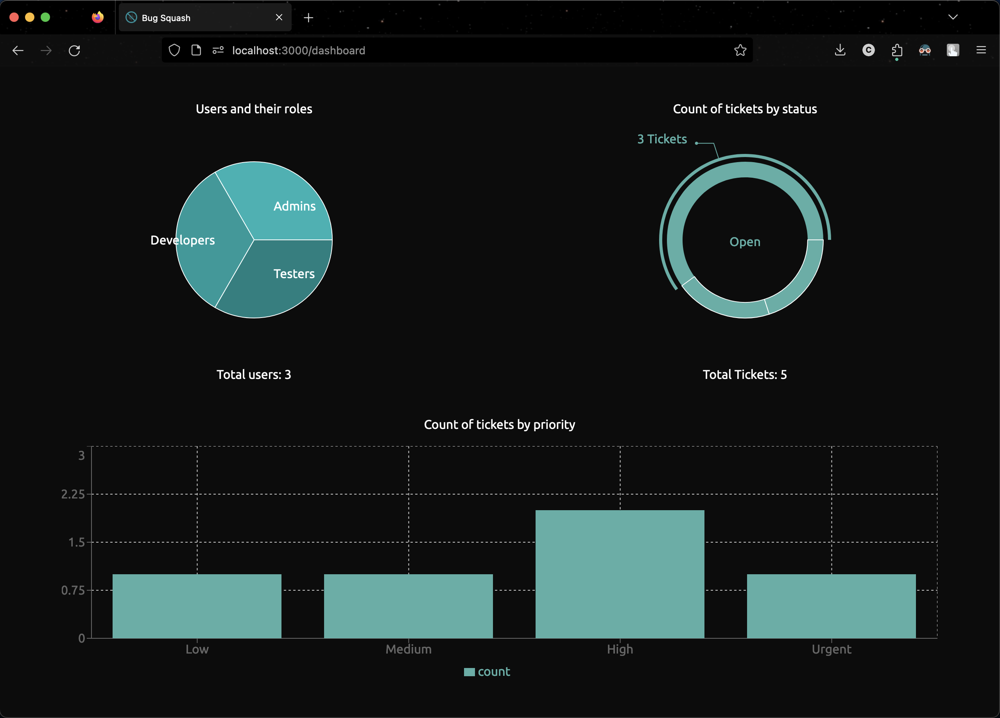

|  |  |
| :---: | :---: |

   

<br />

Bug Squash is a bug tracking application that allows users to list their projects, assign their teammates to projects, and create tickets for bugs that need to be fixed. Users can also comment on tickets and mark them as completed. It has a simple and intuitive user interface that allows users to easily navigate the application and keep track of their projects and tickets.

## Table of Contents

- [Table of Contents](#table-of-contents)
- [Installation and Usage](#installation-and-usage)
- [Contributing](#contributing)
- [License](#license)

## Installation and Usage

To simply use the application, you can visit the [live demo](https://bug-squash.vercel.app/).

To build the application from source, follow these steps:

-   Clone the repository and change the directory to the project directory.

```bash
   git clone https://github.com/ChiragAgg5k/bug-squash
   cd bug-squash/
```

-   Install the dependencies. I recommend using [pnpm](https://pnpm.io/) to install the dependencies, but you can also use npm.

```bash
   npm install
#  pnpm install
```

-   Create a `.env` file in the root directory and add the required environment variables. You can find more information about the required environment variables [here](docs/installation.md).

-   Run the application in development mode.

```bash
   npm run dev
```

## Contributing

To contribute to this project, please fork the repository and submit a pull request. You can checkout the [working](docs/working.md) document for more information on the project's development.

## License

This project is licensed under the MIT License. For more information, please refer to the [LICENSE](../LICENSE.md) file.
